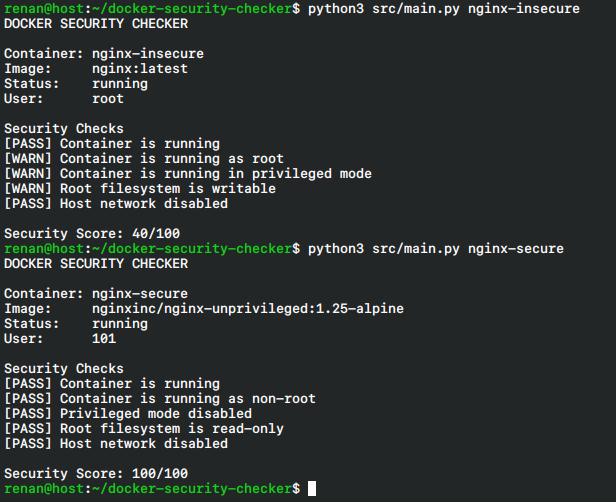

# Docker Security Checker

Um script em Python para verificar configurações básicas de segurança de containers Docker em execução. 

Criei este projeto com a intenção de  praticar automação e entender melhor sobre programação e docker. O script analisa as configurações do container e gera uma pontuação de segurança de 0 a 100.

## O que o script verifica?
Sem precisar instalar dependências extras, a ferramenta usa o `docker inspect` nativo para checar cinco pontos:
- O container está ativo?
- O processo principal está rodando como usuário `root`?
- O container foi iniciado em modo privilegiado?
- O sistema de arquivos raiz está bloqueado para escrita (`read_only: true`)?
- O container está compartilhando a rede diretamente com o host (`network_mode: host`)?

## Como testar na sua máquina

O repositório inclui um arquivo `docker-compose.yml` que cria um laboratório rápido com dois containers Nginx: um configurado de forma insegura e outro aplicando boas práticas. Assim você pode testar a ferramenta imediatamente.

**Pré-requisitos:** Python 3 e Docker instalados (nenhum `pip install` é necessário).

### 1. Suba os containers de teste
```bash
docker compose up -d
```

### 2. Rode o scanner no container vulnerável
```bash
python src/main.py nginx-vulnerable
```
*(Você verá alertas `[WARN]` indicando o uso do root, modo privilegiado e sistema de arquivos gravável, resultando em uma pontuação baixa).*

### 3. Rode o scanner no container seguro
```bash
python src/main.py nginx-secure
```
*(Aqui a pontuação será 100/100, validando o uso de uma imagem 'unprivileged' e as restrições de segurança ativadas).*

### 4. Limpe o ambiente após o teste
```bash
docker compose down
```

## Estrutura do Código
- `src/main.py`: Ponto de entrada que recebe os comandos do terminal.
- `src/docker_checker.py`: Funções de comunicação com o Docker para coleta dos dados (parse de JSON).
- `src/security_checks.py`: Lógica de validação e regras de segurança.
- `docker-compose.yml`: O ambiente de laboratório para demonstração.

